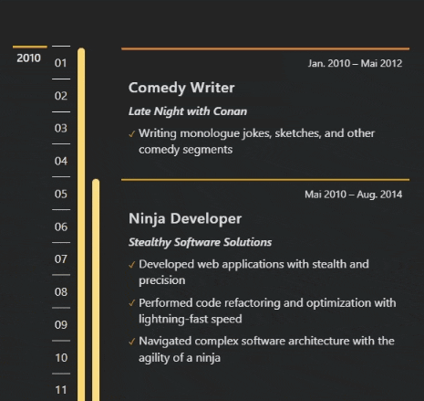

# React Timeline Component

React Timeline Component is a customizable timeline component for React applications. You can use it to display a timeline of events or any other chronological data.

Just provide your timeline data and your desired theme, and the `Timeline` component will take care of everything for you: the `positioning`, a `fancy sticky grid layout` that is `responsive`.

The Timeline component is type safe and was designed in `TypeScript`.

## Demo View

- `desktop`


- `mobile`



## Installation

You can install this component via npm: `npm install react-timeline-component`

## Usage

To use the component, import it into your project and render it with the necessary props.

```tsx
import { Timeline } from 'react-timeline-component';
import { Theme, TimelineData } from 'react-timeline-component/dist/timeline.types';

const timelineData = [
  {
    startPeriod: '2001-05',
    endPeriod: '2003-10',
    title: 'Title of event/period 1',
    organization: 'Organization 1',
    content: ['Content 1 line 1', 'Content 1 line 2'],
    group: 1,
  },
  {
    startPeriod: '2003-03',
    endPeriod: '2007-11',
    title: 'Title of event/period 2',
    organization: 'Organization 2',
    content: ['Content 2 line 1', 'Content 2 line 2', 'Content 2 line 3'],
    group: 1,
  },
  {
    startPeriod: '2008-02',
    endPeriod: '2012-01',
    title: 'Title of event/period 3',
    organization: 'Organization 3',
    content: ['Content 3 line 1'],
    group: 2,
  },
  // Add more events/periods here...
];

const language = 'en-US'; // date language format (e.g. 'de-DE')
const direction = 'asc'; // in which direction timeline goes ('asc' | 'desc')

const theme: Theme = {
  colorAccentPrimary: '#d3a418',
  colorAccentSecondary: '#ff4f04',
  colorText: '#e1e1e1',
  colorBackground: '#242528',
  colorBarHex: '#f7cc4b',
  colorGradation: 4,
};

const App = () => {
  return <Timeline timelineData={timelineData} language={language} direction={direction} theme={theme} />;
};
```

### Notices

- The timeline starts automatically in the year of the earliest period and ends in the year of the latest period.
- If a period is still active and doesn't have an end date, use an empty string for the `endDate` property in the timeline data.
- The language prop is used to define the format of the date strings displayed in the period text box. For example, you can set it to `de-DE` for German language formatting.
- The direction prop defines in which direction the timeline should go. You can set it to either `asc` for ascending (i.e., from past to present) or `desc` for descending (i.e., from present to past).
- The component provides several color theming props to allow for customization of the visual appearance. Make sure to provide the required colors in the proper format (e.g., as hexadecimal values if needed in the type definition). You can use the `theme` object e.g. to switch between dark and light mode.

### Usage Advices

- To improve performance and avoid unnecessary re-renders, consider memoizing the `timelineData` and `theme` objects when passing them to the component as props. You can use the React `useMemo` hook for this purpose. The component is wrapped in `React.memo()` so the component function is not re-rendered if the object references remain stable..
- If you generate your `timelineData` object dynamically (e.g. you could dynamically merge multiple data arrays containing different `group` numbers for filtering purposes), also consider memoizing it to prevent needless computations and renders.
- When designing your timeline, be mindful of the number of overlapping periods to ensure that the layout remains clear and readable (take care to limit them to at most 3 or 4)

## Props

| Name                   | Type            | Required | Default   | Description                                                                      |
| :--------------------- | :-------------- | :------- | :-------- | :------------------------------------------------------------------------------- |
| timelineData           | TimelineData[]  | Yes      | N/A       | An array of timeline data to display. See below for the details of TimelineData. |
| language               | LocalesArgument | Yes      | N/A       | The locale for the date format of the timeline (e.g. `en-US`, `de-DE`).          |
| direction              | 'asc' or 'desc' | Yes      | N/A       | The direction in which the timeline should be displayed.                         |
| theme                  | Theme           | Yes      | See below | The color theme for the timeline. See below for the details of Theme.            |
| stickyMarginTopDesktop | number          | No       | 60        | The margin top value in pixels for the sticky effect on desktop devices.         |
| stickyMarginTopMobile  | number          | No       | 15        | The margin top value in pixels for the sticky effect on mobile devices.          |

## TimelineData

`TimelineData` is an object type that represents a single item on the timeline.

| Name         | Type     | Required | Default | Description                                                                                       |
| :----------- | :------- | :------- | :------ | :------------------------------------------------------------------------------------------------ |
| startPeriod  | string   | Yes      | N/A     | The start date of the timeline item in YYYY-MM format.                                            |
| endPeriod    | string   | Yes      | N/A     | The end date of the timeline item in YYYY-MM format. Use an empty string ('') for active periods. |
| title        | string   | Yes      | N/A     | The title of the timeline item.                                                                   |
| organization | string   | Yes      | N/A     | The organization associated with the timeline item.                                               |
| content      | string[] | Yes      | N/A     | An array of strings representing the text content of the timeline item.                           |

## Theme

`Theme` is an object type that lets you customize the Timeline component

| Prop                 | Type              | Default            | Description                                                                             |
| :------------------- | :---------------- | :----------------- | :-------------------------------------------------------------------------------------- |
| colorAccentPrimary   | string (required) | N/A                | The primary color accent of the timeline. Must be in hex format, starting with a `#`.   |
| colorAccentSecondary | string (optional) | colorAccentPrimary | The secondary color accent of the timeline. Must be in hex format, starting with a `#`. |
| colorText            | string (required) | N/A                | The text color of the timeline. Must be in hex format, starting with a `#`.             |
| colorBackground      | string (required) | N/A                | The background color of some timeline elements.                                         |
| colorBarHex          | string (required) | N/A                | The color of the timeline bar. Must be in hex format, starting with a `#`.              |
| colorGradation       | number (optional) | 4                  | The gradation between the automatically generated color variants for the period bars.   |
